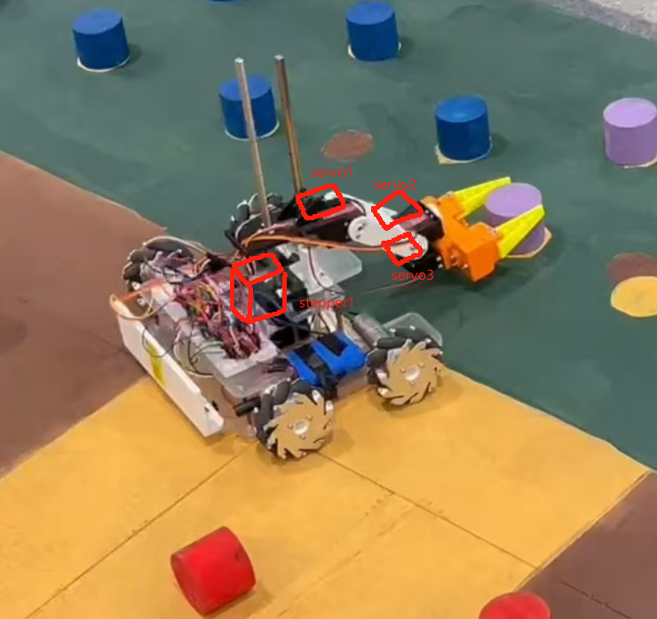
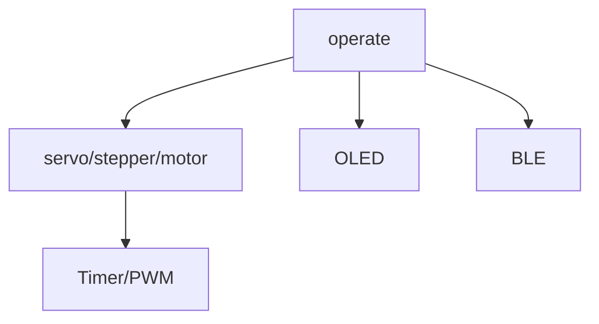
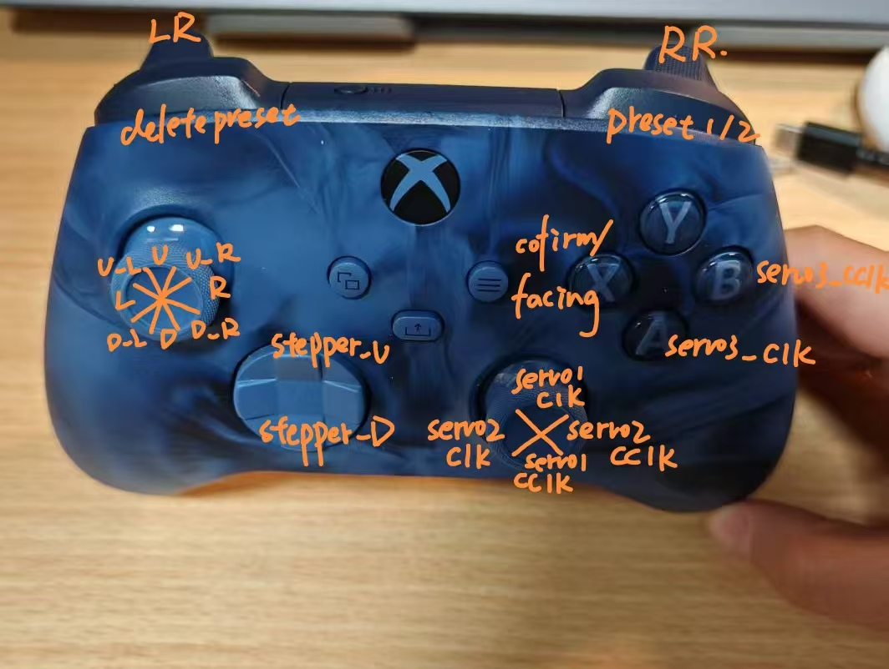

# esp32_car
An esp32-control car, featuring OLED_display, a liftable robotic arm, Mecanum wheels and BLE control. 

## for developer
```
cd <your esp folder>
git clone https://github.com/A-lexisL/esp32_car.git
cd esp32_car
git checkout demo #change to the demo branch
```
In the demo branch, you can do some tests to get familiar with the esp32.  

After the basic settings in main branch are done, create a dev branch.
```
git checkout main #switch to main branch
git checkout -b <devbranch> 
git push -u origin <devbranch>
``` 
In the dev branch, develop the specific function (TBD).

### pin
please refer to the [pin.xlsx](pin.xlsx) for the pin map.  
**(Attention: please do not modify pin.xlsx)**

### BLE deps
esp32 communicates with the controller(only XBOX Wireless Controller now) through BLE.
refer to https://github.com/A-lexisL/BLERetro32  

## for user
### car structure

### pin
[pin](pin.xlsx)
### hardware structures
board: esp32-s3-DevKitC-1  
modules: 128\*64 IIC OLED, DRV8825(stepper driver), tb6612\*2(motor driver),3.3v Step-down Converter, 6v lithium battery(power servos directly and esp32 through the step-down Converter),12 v lithium battery(power motor and stepper).
### software structure

### BLE
the esp32 communicates with the controller through BLE. Currently, this program only recognizes XBOX Wireless Controller(the bluetooth name has to be exactly the same, and the controller should support BLE). 


## unsolved issues
1. gpio21 could not be used for OLED_I2C_SCL(if change the macro `OLED_I2C_SCL` in OLED.h to GPIO_NUM_21, there will be garbled text on the OLED display), still don't know the reason.  

## future characteristics
1. PID control for right translation and left translation (due to unstable connection between the coupling and the motor, ueven ground .etc, those two are not stable).